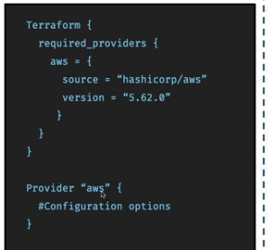

# **Introduction to Terraform Deployment**

**What is a Terraform Provider?**
---
- A Terraform provider is a **plugin** that allows Terraform to talk to an external system (e.g. a cloud provider)

- Its like a translator between Terraform and the service you want to manage.

- **AWS Provider** → lets Terraform create/manage AWS resources (EC2, S3, RDS, etc.).

**Understanding Terraform and AWS Provider Code**
---


**This code is split into two blocks:**
---

1.**The Terraform Block**

- **Purpose:** Tells Terraform which providers it needs, where to download them from, and which version to use.

```bash
terraform {
  required_providers {
    aws = {
      source  = "hashicorp/aws"
      version = "5.62.0"
    }
  }
}
```
- `aws` → The name of the provider.

- `"hashicorp/aws"` → This means Terraform will download the AWS provider plugin from the **Terraform Registry under the hashicorp namespace.**
- `version = "5.62.0"` → Locks the AWS provider to this version.

2.**The Provider Block**

- **Purpose:** This is the part that configures  how to connect to a specific provider through settings (like AWS)

```bash
provider "aws" {
  # Configuration options (e.g., region, profile)
  region = "us-east-1"
}
```