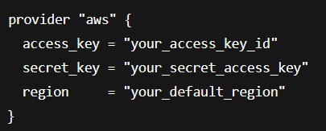

# **Creating an EC2 Instance - DEMO!**

**Initialize your working directory**
---
- Go to terraform registry, find your provider, and copy the **provider code**, create a `.tf `file, paste the code, run `terraform init`

- Once the directory has been initialized, the **terraform state file** (and other files) will be created automatically.

**How to get the correct resource block for EC2**
---
- Terraform registry - search for resource block- copy and paste into a new .tf file

**Configure your resource block to deploy a simple EC2 instance**
---
- Login to the AWS management console and get the **AMI ID** you want to use and copy it into the resource block

- Choose the instance type e.g. t2.micro

- Take note of which region you are in

**How to specify which account to deploy things in**
---
- You'll need an access key and a secret access key, for the account you'd want to deploy things in

- You can set these in a **provider block:** 
- (make sure to do this before initializing)

- Or you can do it via the terminal 

- Then you can run a **terraform plan/apply** to apply your changes
