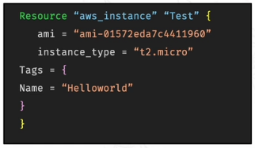

# **Resource Blocks**

- Purpose: Defines a piece of **infrastructure** Terraform will manage (e.g., EC2 instance, database, networking).

- The resource block is where you specify what you want to **create, update, or delete** about that resource

- Each resource block corresponds to a **specific resource type** provided by the Terraform provider you're using. In this case, we're using AWS.

**Simple example of AWS resource block**
---

**Structure:**

- `resource "<type>" "<name>"` { ... }
- Type = resource type from the provider
- Name = The name you give the resource 

**Attributes inside the resource block:** { ... }

- AMI, Instance Type, Tags
- **Tags:** A way to label and categorize your resources. (dev, prod, staging)
