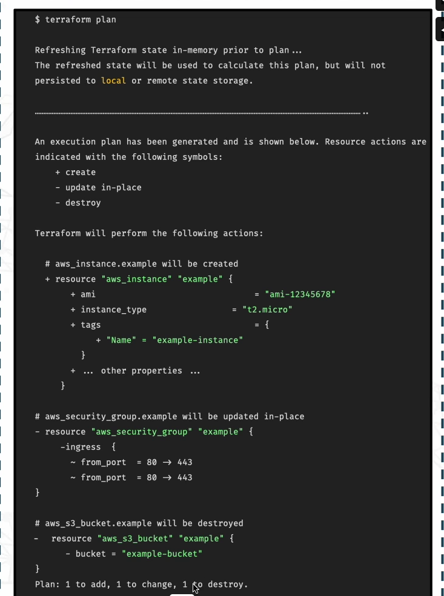

# **Previewing Changes with Terraform Plan**

- **Purpose:** Previews the changes Terraform will make before applying them — a safety check to **ensure deployments match your expectations**.

**Why it matters:**
---
- Encourages a security-first mindset.

- Helps avoid accidental deletion or misconfiguration.

- Lets you confirm the outcome before running terraform apply.

**How it works**
---
- Analyzes your configuration files (desired state).

- Compares them to your **Terraform state file** (current state).

- Generates a plan showing what changes are needed.

**Example**
---

**Output Symbols:**

- `+` (Create) → a new resource will be added.

- `~` (Update in place) → an existing resource will be modified.

- `-` (Destroy) → a resource will be removed.

**Plan Summary:** 

- Shows totals of resources to add, change, and destroy.

- **Example:** 1 to add, 1 to change, 1 to destroy.

- **Always check this,** if you only expect new resources, the destroy count should be 0.