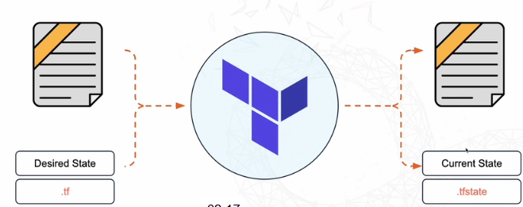

# **Terraform State File**

**When you use Terraform, there are two important files to keep in mind:**
---
- `.tf` files = **Terraform configuration files**. They describe the desired state of your infrastructure (what you want). Example: “I want 3 EC2 instances.”

- `terraform.tfstate` file = **Terraform state file**. It’s a record of the **current state of your infrastructure** (what you have) Example: “Right now, I only have 2 EC2 instances running.”

- Terraform’s job = compares the **desired** state with the **current state**, and then figures out the exact changes needed to **make them match** 

**Importance of `.tfstate`**
---
- Without the state file, Terraform wouldn’t know what's already deployed and would have no way to tell if you wanted to **add, change or delete** something.

- The terraform state file helps ensure **idempotency**

**What is idempotency?**
---
**Idempotency means:** 

- No matter how many times you run Terraform, the result is the same 

- If you only update one resource, Terraform changes only to that specific resource

- Leads to **efficient, predictable deployments.**