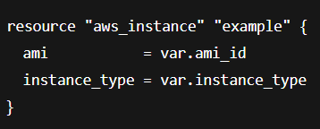

# **Using and Configuring Input Variables**

- Input variables are **values that you pass into your configuration** removing the need to hardcode things like the AMI ID or instance type etc. `(refer to Input-Variables.md)`



- You can define input variables to receive values from a **user, the command line, or variable files**

- More info can be found on the Terraform registry

**Variable blocks**
---
- A **variable block** has the keyword `variable` at the start and is followed by a label, **which is the name of your variable**

- When referencing variables, you will be calling them by **var.whatever you have named them** e.g. `var.instance_type`

- So you need to ensure that you don't duplicate or repeat things.

- Its **best practice** to define variables in a `variables.tf` file.

```bash
variable "instance_type" {
  type        = string
  description = # documents the purpose of a variable and the value the block expects.
  default = t2.micro
}

variable "ami_id"
  type = string
  default = ami-1234567
```