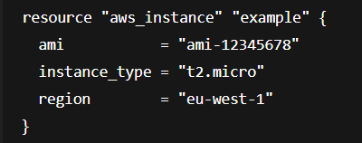

# **Introduction to Variables in Terraform**

**What are variables?**
---

- Variables make configurations **dynamic, reusable, and easier to manage** by avoiding hardcoded values like **AMI IDs, instance types, or regions.**

**For example**
---
- Let’s say you want to create an EC2 instance in Terraform. Normally, you might write this:

- However, instead of always hardcoding the *AMI ID, region, instance type, etc* every time you want to create an instance, you can **define them as variables** and pass them in:

- This is an example of an **input variable,** which allows you **to pass values into resources.** 

- **Important:** Variables need to referenced in your configuration files in the appropriate way.

**Benefits**
---
- Follows the DRY principle (Don’t Repeat Yourself), reduces repetition, and simplifies changes across environments.

**Interview one liner:**
---
- “Terraform variables make configurations dynamic and reusable by allowing input values like AMI IDs or instance types to be passed into resources, following the DRY principle, and are best defined in a separate variables.tf file.”