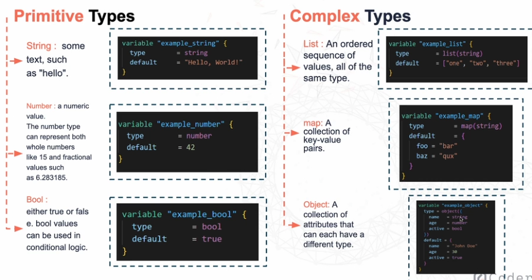

# **Understanding Terraform Variables**



**Primitive types** 
---
**String**

```bash
# String Variable
variable "region" {
  type    = string
  default = "eu-west-1"
}

# Example usage
provider "aws" {
  region = var.region
}
```
**Number**

```bash
# Number variable for EBS volume size
variable "volume_size" {
  type    = number
  default = 20
}

# Example usage
resource "aws_ebs_volume" "example" {
  availability_zone = "eu-west-1a"
  size              = var.volume_size
}
```

**Bool (true/false)**

```bash
# Bool variable for monitoring an instance, set to true unless a value is provided elsewhere
variable "enable_monitoring" {
  type    = bool
  default = true
}

# Example usage
resource "aws_instance" "example" {
  ami           = "ami-123456"
  instance_type = "t2.micro"

  monitoring = var.enable_monitoring
}
```
**Complex types**
---
**List (ordered sequence, same type)**

```bash
variable "availability_zones" {
  type    = list(string)
  default = ["eu-west-1a", "eu-west-1b", "eu-west-1c"]
}
```
- Use when you need an ordered list of similar values (like AZs, subnet IDs).

**Map (key-value pairs)**
```bash
# Mapping instance AMIs to certain regions
variable "instance_amis" {
  type = map(string)
  default = {
    us-east-1 = "ami-123"
    eu-west-1 = "ami-456"
  }
}
```
**Object (structured group, mixed types)**

```bash
# EC2 instance configuration as an object

variable "ec2_config" {
  type = object({
    instance_type = string
    volume_size   = number
    enable_monitoring = bool
    tags = map(string)
  })

  default = {
    instance_type     = "t3.micro"
    volume_size       = 20
    enable_monitoring = true
    tags = {
      Name        = "MyAppServer"
      Environment = "dev"
    }
  }
}
```
```bash
# Usage in a resource

resource "aws_instance" "example" {
  ami           = "ami-1234567890abcdef0"
  instance_type = var.ec2_config.instance_type
  monitoring    = var.ec2_config.enable_monitoring

  tags = var.ec2_config.tags

  root_block_device {
    volume_size = var.ec2_config.volume_size
  }
}
```
- Object = full recipe card (all ingredients + instructions).

- Use when you need a structured config with multiple attributes