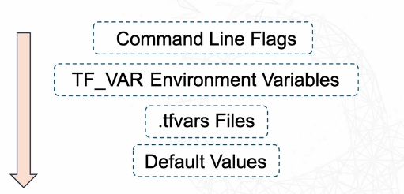

# **Variable hierarchy**

- Variable Hierarchy = Terraform’s way of deciding which value to use **when the same variable is defined in multiple places.**

- 

**The 4 levels of hierarchy (from lowest → highest priority)**
---
1. **Default values** (lowest priority): Set directly in your variable block. Used only if you don’t provide the variable anywhere else.

2. **`.tfvar` files:** A file where you store variable values

3. **Environment variables** (prefixed with TF_VAR_): Terraform can use environment variables to set the value of a variable

```bash
export TF_VAR_instance_type="t3.medium"
terraform apply
```

4. **Command line flags** (highest priority)`terraform apply -var="instance_type=t3.large"`
